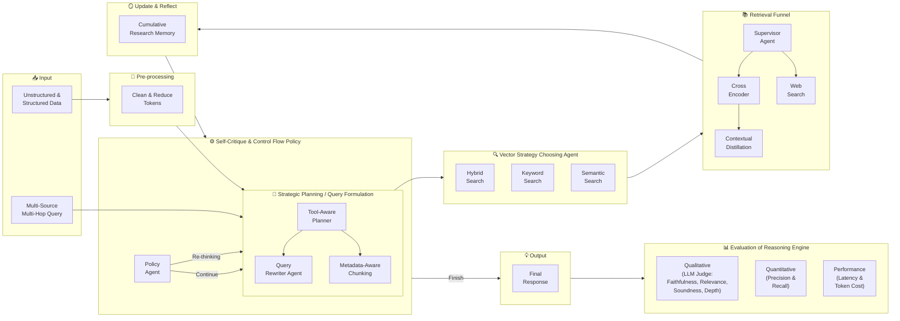

# Agentic Deep-Thinking RAG Pipeline — Block Diagram & Description

## Block Diagram

---

## Description

### Overview

The **Agentic Deep-Thinking RAG Pipeline** is an advanced Retrieval-Augmented Generation architecture that replaces the traditional linear, one-shot RAG approach with a **cyclic, agent-driven reasoning loop**. It is designed to handle complex, multi-hop queries that span multiple sources and require iterative reflection before producing a final answer.

---

### Stage-by-Stage Breakdown

#### 1. Input
The pipeline accepts two kinds of input simultaneously:
- **Unstructured and structured data** — internal documents, databases, files from the organization.
- **Multi-source, multi-hop query** — a complex user question that requires reasoning across multiple pieces of evidence.

---

#### 2. Pre-processing
Before indexing, raw data is cleaned to:
- Reduce token count by removing unnecessary information.
- Normalize and structure text for downstream chunking.

This step ensures the retrieval index is as signal-dense as possible.

---

#### 3. Strategic Planning / Query Formulation
The agent's "brain." It performs two core tasks:

| Sub-Component | Role |
|---|---|
| **Tool-Aware Planner** | Decomposes the complex query into a structured, multi-step research plan. Decides which tool (document search vs. web search) is appropriate for each sub-question. |
| **Query Rewriter Agent** | Rewrites vague sub-questions into specific, keyword-rich queries that retrieval engines can act on precisely. |
| **Metadata-Aware Chunking** | Tags each document chunk with its section metadata (e.g., "Item 1A. Risk Factors"), enabling surgical, targeted retrieval rather than full-index brute-force search. |

---

#### 4. Vector Strategy Choosing Agent
A supervisor agent that dynamically selects the best retrieval strategy for each sub-question:

| Strategy | When Used |
|---|---|
| **Hybrid Search** | Balances semantic and keyword signals; best for general queries. |
| **Keyword Search (BM25)** | Best for exact factual lookups where specific terms matter. |
| **Semantic Search** | Best for conceptual or meaning-based questions. |

---

#### 5. Retrieval Funnel
A multi-stage precision pipeline:

1. **Supervisor Agent** — routes the rewritten query to the selected search strategy.
2. **Web Search** — triggered when the planning agent determines the answer requires live internet data (e.g., recent news not in the local document).
3. **Cross Encoder** — re-ranks the top-10 candidate chunks by jointly scoring each against the query, producing a high-precision top-3 result.
4. **Contextual Distillation** — compresses the top-3 chunks into a dense, signal-rich paragraph, removing noise and reducing token cost for the reasoning LLM.

---

#### 6. Update & Reflect (Cumulative Research Memory)
After each retrieval step, a **Reflection Agent**:
- Summarizes the distilled context into a single factual sentence.
- Appends it to the `past_steps` list in the **RAGState** object.

The RAGState tracks the full research session: original query, plan, accumulated findings, current step index, and the final answer slot. This gives the agent true memory across steps.

---

#### 7. Self-Critique & Control Flow Policy
The policy agent inspects the RAGState after each reflection and makes a strategic decision:

| Decision | Meaning |
|---|---|
| **Continue** | Move to the next planned research step. |
| **Re-thinking** | Hit a dead end — revise the remaining plan and loop back to Planning. |
| **Finish** | Sufficient evidence has been gathered — proceed to generate the final response. |

This loop is what makes the system truly *agentic*: it is not a chain, but a thinking cycle.

---

#### 8. Final Response Generation
Once the policy agent signals **Finish**, the synthesis agent:
- Receives all `past_steps` from RAGState.
- Uses the most powerful reasoning LLM.
- Merges evidence from documents and web search into one comprehensive, cited answer.

---

#### 9. Evaluation of Reasoning Engine
The output is evaluated across three dimensions:

| Dimension | Metrics |
|---|---|
| **Qualitative** | LLM-as-judge: Faithfulness, Relevance, Soundness, Depth |
| **Quantitative** | Retrieval Precision and Recall |
| **Performance** | Latency (time per query) and Token Cost |

---

### Key Design Principles

- **Architecture over Intelligence** — RAG failures are architectural, not a lack of LLM capability. The cyclical loop fixes what a linear pipeline cannot.
- **State is memory** — RAGState gives the agent continuity across steps; without it, every step is blind.
- **Metadata is precision** — section-tagged chunks let the agent restrict search to exactly the right part of a document.
- **Dual LLM strategy** — a powerful model handles planning and synthesis; a faster, cheaper model handles routine sub-tasks.
- **Three-dimensional evaluation** — measuring qualitative quality, retrieval accuracy, and system efficiency together gives a complete picture of pipeline health.

---

*Based on: Fareed Khan — "Building an Agentic Deep-Thinking RAG Pipeline to Solve Complex Queries" · Level Up Coding · Oct 2025*
