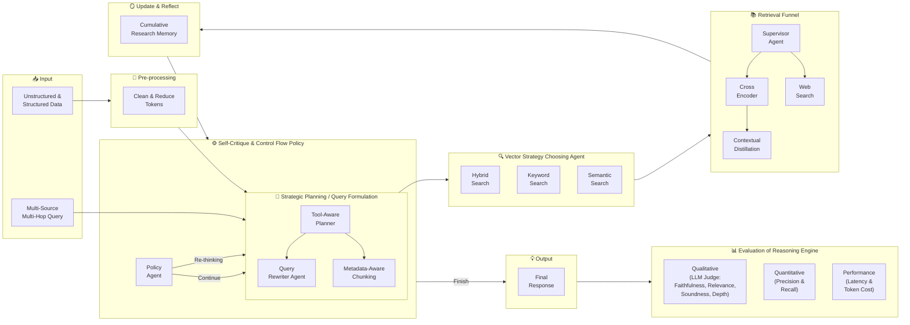

# Agentic Deep-Thinking RAG Pipeline — Mermaid Block Diagram

> This file contains the **Mermaid renderable block diagram** for the deep-thinking pipeline.
> For architecture descriptions, executor details, and One-Shot vs Deep-Thinking comparison, see [`README.md`](README.md) and [`RAG.Comparison.md`](RAG.Comparison.md).

## Block Diagram

---

